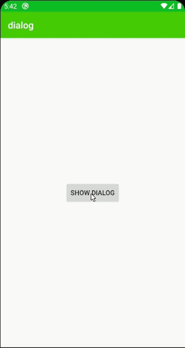

# SDialog
A simple and easy to use Dialog build using Android Dialog,

[](https://jitpack.io/#Shahzainali/SDialog)


### Installation


Add it in your root build.gradle at the end of repositories:
```sh
	allprojects {
		repositories {
			...
			maven { url 'https://jitpack.io' }
		}
	}

Step 2. Add the dependency

	dependencies {
	        implementation 'com.github.Shahzainali:SDialog:1.3.1'
	}
```
### Usage
```sh
SDialog.Builder(this)
                .setTitle("My Dialog")                  //set title
                .setMessage("this")                     //set message
                .setDuration(5000)                      //how long dialog will display
                .setSpeed(400)                          //animation speed
                .setCancellable(true)
                .setBackgroundColor(Color.DKGRAY)
                .setTitleColor(Color.WHITE)
                .setMessageColor(Color.WHITE)
                .setMessageTypeface(Typeface.createFromAsset(assets, "Poppins-Light.ttf"))
                .setTitleTypeface(Typeface.createFromAsset(assets, "Poppins-Medium.ttf"))
                .setTitleTextSize(20F)
                .setMessageTextSize(14F)
                .setImage(R.drawable.cross)             //optional
                .setImageTint(Color.CYAN)
                .setRadius(10F)
                .build()
```




### Contact
```sh
| Email |           shahzainali93@gmail.com |
| Linkedin |        https://www.linkedin.com/in/shahzainali/ |
| stackoverflow |   https://stackoverflow.com/users/5154783/shahzain-ali |
```


